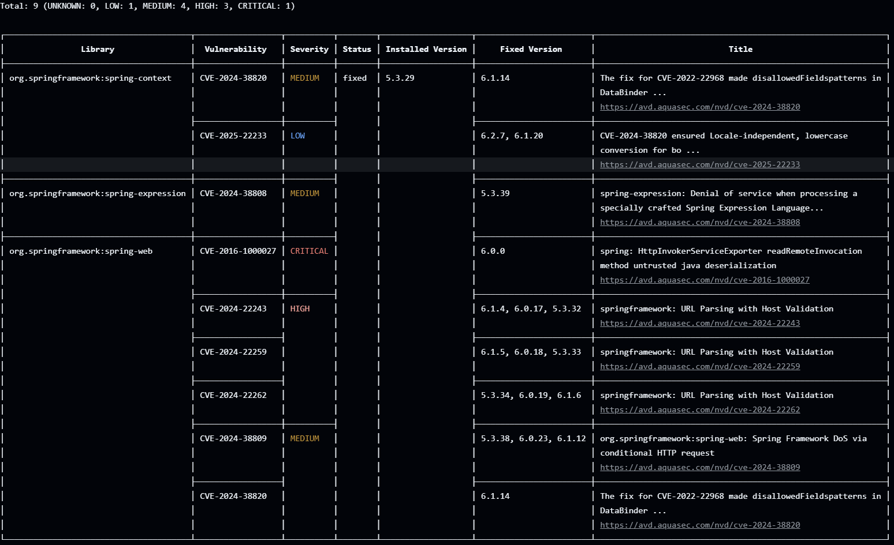
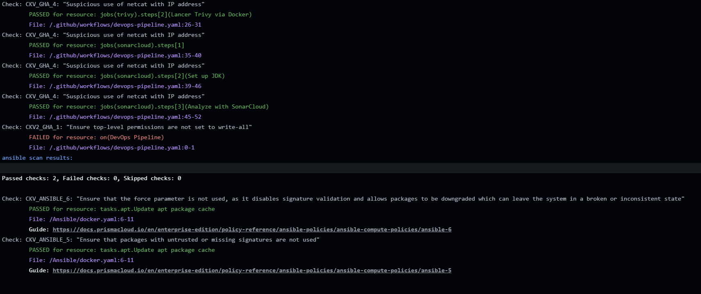
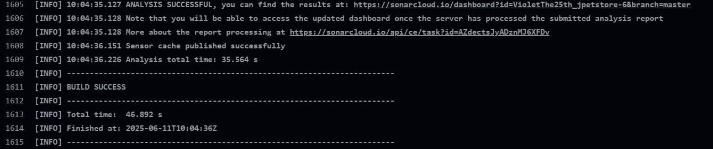
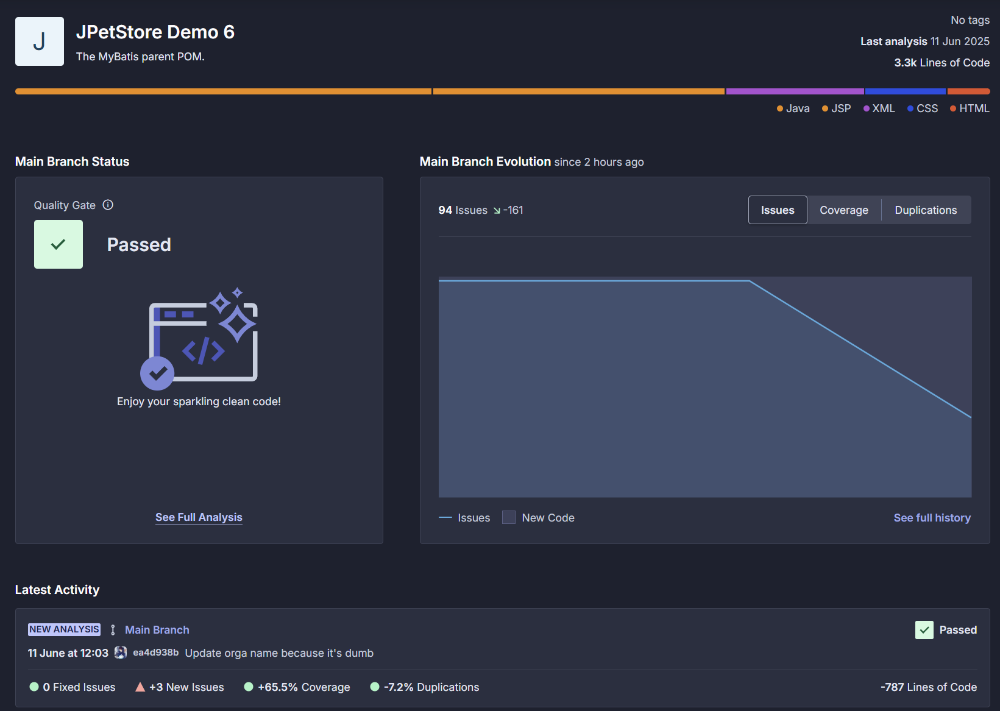
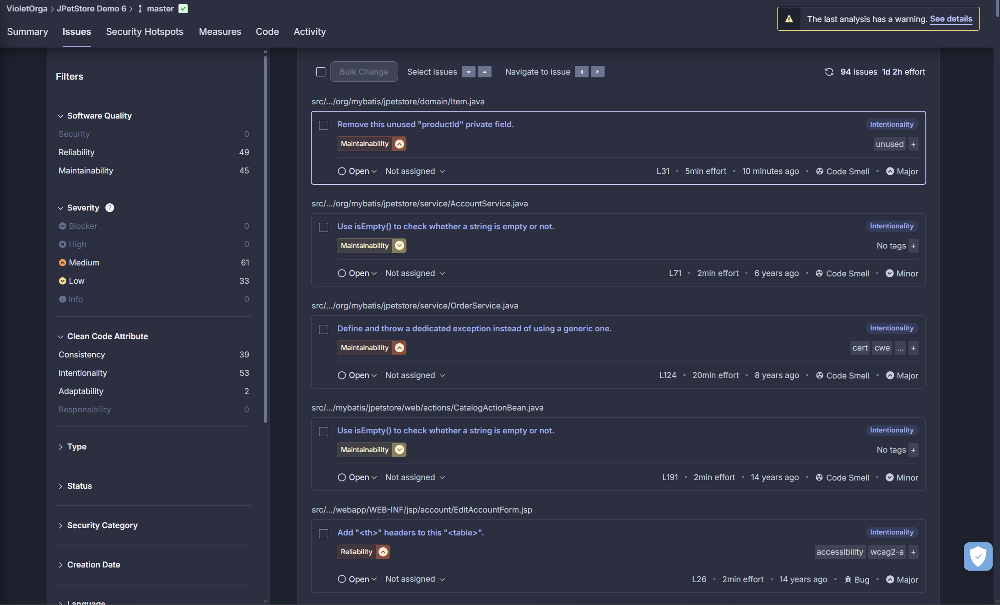

Exercice pipeline
=================

J'ai choisis d'utiliser **Github Actions** pour cet exercice, étant déjà familié avec cet outil.

J'ai créé un nouveau fichier **devops-pipeline.yaml** dans le dossier `.github/workflows` afin de lancer un **scan IaC** avec **Checkov**, un **scan de vulnérabilité** avec **Trivy**, ainsi qu'une analyse **SonarCloud** (et non pas **Sonarqube**, car c'est bien plus simple et léger à utiliser).

Je n'ai pas implémenter les extentions VSCode, car j'utilise des versions **Docker**, donc je ne les ai pas installés sur mon ordinateur.

## Trivy

**Trivy** est le plus simple des jobs du pipeline, je l'ai fais comme suit : 
```yaml
  trivy:
    name: Scan de vulnérabilités avec Trivy
    runs-on: ubuntu-latest
    steps:
      - uses: actions/checkout@v3

      - name: Lancer Trivy via Docker
        run: |
          docker run --tty --volume "$(pwd):/scan" aquasec/trivy fs /scan
```

J'ai repris la commande qu'on a vu précédemment et utilisé la version **Docker** de **Trivy**. 

J'obtiens cette réponse sur **Github Actions** :




## Checkov

Pour **Checkov**, j'ai choisis de partir également sur la version **Docker**, et ai donc utilisé ce job : 
```yaml
jobs:
  checkov:
    name: Scan IaC avec Checkov
    runs-on: ubuntu-latest
    steps:
      - uses: actions/checkout@v3

      - name: Lancer Checkov via Docker
        run: |
          docker run --tty --volume "$(pwd):/scan" bridgecrew/checkov -d /scan --soft-fail
```

J'ai ajouté `--soft-fail` à la fin de la commande afin que **Checkov** relève les erreurs, mais ne stoppe pas l'exécution du **pipeline**. 

J'obtiens cette réponse en partie sur **Github Actions** :



## SonarQube

Pour l'analyse **SonarQube**, j'ai choisis d'utiliser **SonarCloud**, car c'est bien plus simple à utiliser et à paramétrer, et ça ne demande aucune installation. 

On peut voir que j'ai relié mon projet créé sur **SonarCloud**, je lui passe ici les informations de mon compte ainsi que de mon projet. J'ai également dû paramétrer un *secret* que j'ai ajouté sur **Github**.

```yaml
  sonarcloud:
    name: Analyse SonarCloud
    if: github.repository_owner == 'violetthe25th'
    runs-on: ubuntu-latest
    steps:
      - uses: actions/checkout@v3
        with:
          fetch-depth: 0

      - name: Set up JDK
        uses: actions/setup-java@v3
        with:
          java-version: 17
          distribution: zulu

      - name: Analyze with SonarCloud
        run: |
          ./mvnw verify -Dlicense.skip=true --no-transfer-progress || true
          ./mvnw jacoco:report
          ./mvnw sonar:sonar -B -Dsonar.projectKey=VioletThe25th_jpetstore-6 -Dsonar.organization=violetthe25th -Dsonar.host.url=https://sonarcloud.io -Dsonar.login=$SONAR_TOKEN
        env:
          GITHUB_TOKEN: ${{ secrets.GITHUB_TOKEN }}
          SONAR_TOKEN: ${{ secrets.SONAR_TOKEN }}
```



Sur la page **SonarCloud** suite au push :



La page des **issues** qu'il a détecté dans le projet :

