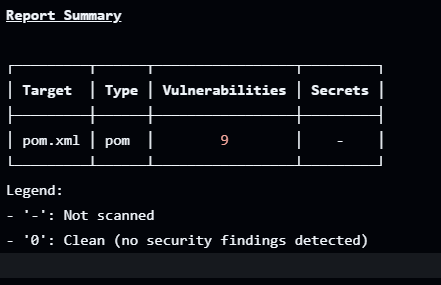

Exercice pipeline
=================

J'ai choisis d'utiliser **Github Actions** pour cet exercice, étant déjà familié avec cet outil.

J'ai créé un nouveau fichier **devops-pipeline.yaml** dans le dossier `.github/workflows` afin de lancer un **scan IaC** avec **Checkov**, un **scan de vulnérabilité** avec **Trivy**, ainsi qu'une analyse **SonarCloud** (et non pas **Sonarqube**, car c'est bien plus simple et léger à utiliser).

## Trivy

**Trivy** est le plus simple des jobs du pipeline, je l'ai fais comme suit : 
```yaml
  trivy:
    name: Scan de vulnérabilités avec Trivy
    runs-on: ubuntu-latest
    steps:
      - uses: actions/checkout@v3

      - name: Lancer Trivy via Docker
        run: |
          docker run --tty --volume "$(pwd):/scan" aquasec/trivy fs /scan
```

J'ai repris la commande qu'on a vu précédemment et utilisé la version **Docker** de **Trivy**. 

J'obtiens cette réponse sur **Github Actions** :




## Checkov

Pour **Checkov**, j'ai choisis de partir également sur la version **Docker**, et ai donc utilisé ce job : 
```yaml
jobs:
  checkov:
    name: Scan IaC avec Checkov
    runs-on: ubuntu-latest
    steps:
      - uses: actions/checkout@v3

      - name: Lancer Checkov via Docker
        run: |
          docker run --tty --volume "$(pwd):/scan" bridgecrew/checkov -d /scan --soft-fail
```

J'ai ajouté `--soft-fail` à la fin de la commande afin que **Checkov** relève les erreurs, mais ne stoppe pas l'exécution du **pipeline**. 

J'obtiens cette réponse en partie sur **Github Actions** :


## SonarClouc

